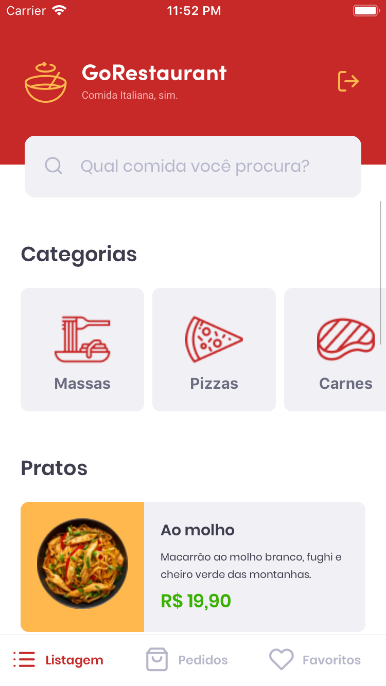
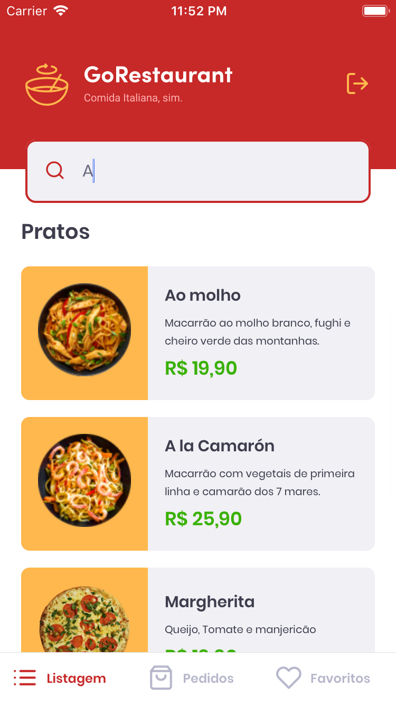
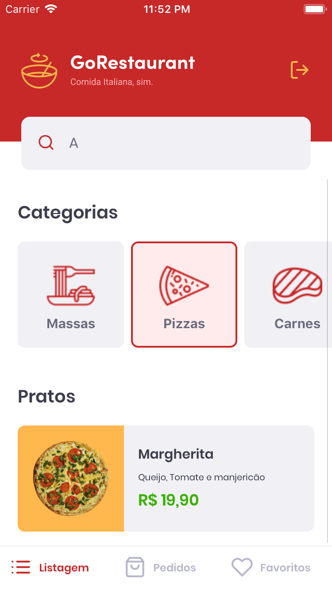
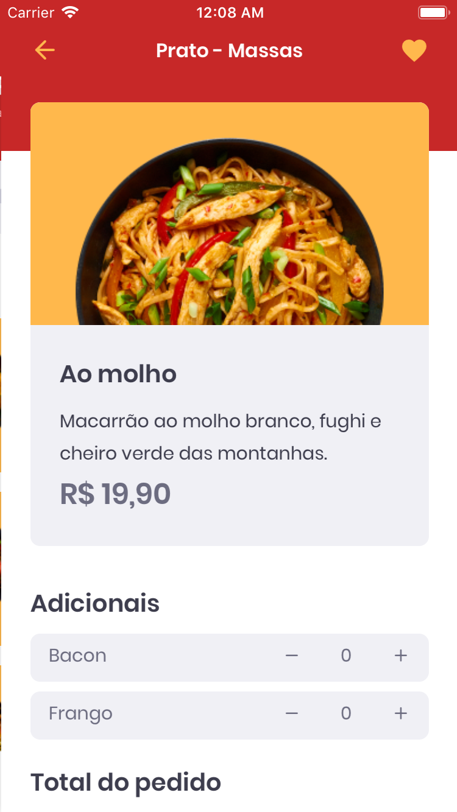
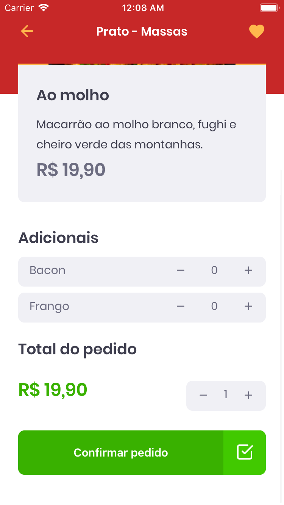
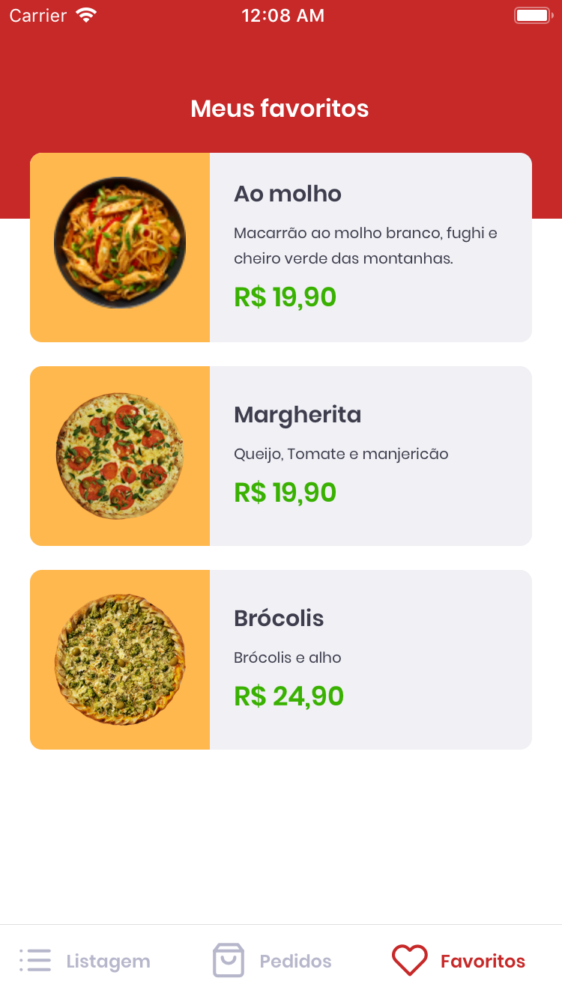
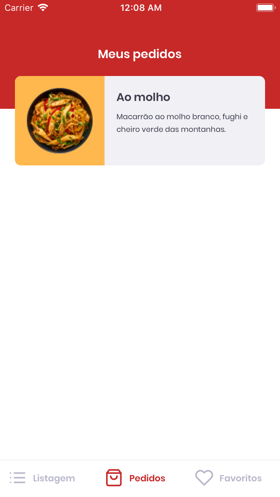

🚀 <h1>GoRestaurant Mobile </h1>

<h3>Client Mobile Version:</h3>

In this challenge proposed by Rocketseat's Bootcamp I developed an application called GoRestaurant.
In his implementation I was able to practice what I have learned so far in React.js along with TypeScript, using the concept of CRUD (Create, Read, Update, Delete).
    
This application connects to a fake API, displays food dishes and allows the creation, removal and updating of these dishes.

Mobile Client Version: https://github.com/tialaR/GoRestaurant-Web-Bootcamp-GoStack-Rocketseat-Desafio-10

 

 _&nbsp;&nbsp;_  
 

 _&nbsp;&nbsp;&nbsp;_ 
 

 _&nbsp;&nbsp;&nbsp;_  
 

 _&nbsp;&nbsp;&nbsp;_ 
 

 _&nbsp;&nbsp;&nbsp;_ 

