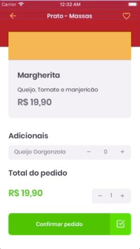
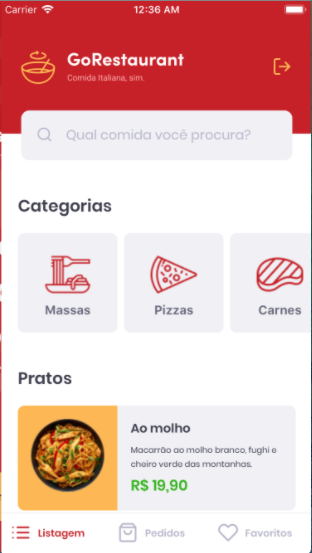
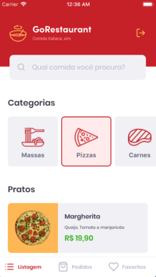
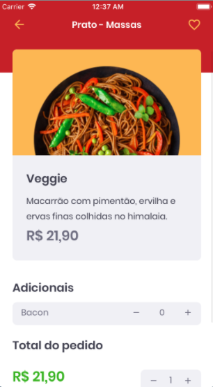
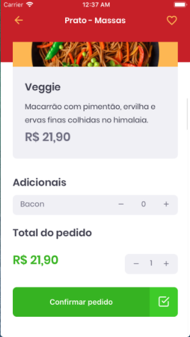
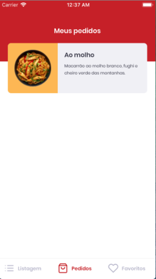
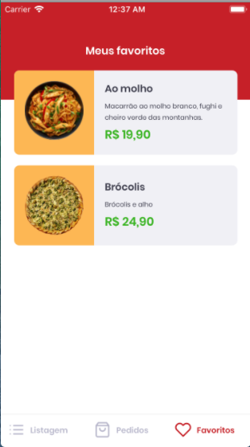
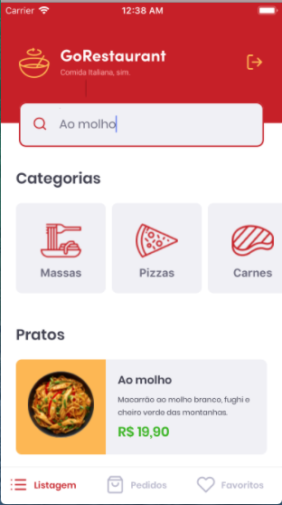

<h1>🚀 GoRestaurant Mobile </h1>

<h3>Client Mobile Version:</h3>

In this challenge I developed another application, GoRestaurant Mobile, only this time the mobile version for the client. Where I practiced what you’ve learned so far in React Native along with TypeScript, to create a small app for ordering food.

This application connects to a Fake API, and displays and filters the API's food dishes and allows the creation of new orders and favorite dishes.

Web Owner Version: https://github.com/tialaR/GoRestaurant-Web-Bootcamp-GoStack-Rocketseat-Desafio-10

 

 _&nbsp;&nbsp;_  
 _&nbsp;&nbsp;_  
 

 _&nbsp;&nbsp;&nbsp;_ 
 

 _&nbsp;&nbsp;&nbsp;_  
 

 _&nbsp;&nbsp;&nbsp;_ 
 

 _&nbsp;&nbsp;&nbsp;_ 

